## 2조 펫토리

기능 담당 : 채팅

## 프로젝트 설계
## 요구사항 명세서

-
    [요구사항 명세서](https://docs.google.com/spreadsheets/d/1xn3WYrcm1DOls6SgFvD8YYsPRyOG0y4JGV1NGI4js7w/edit?gid=0#gid=0)
    

  
  
  
  
  
  
    
## 데이터베이스

### 논리 모델링

- 논리 모델링
    
    

    
    
### 물리 모델링

- 물리 모델링
    
    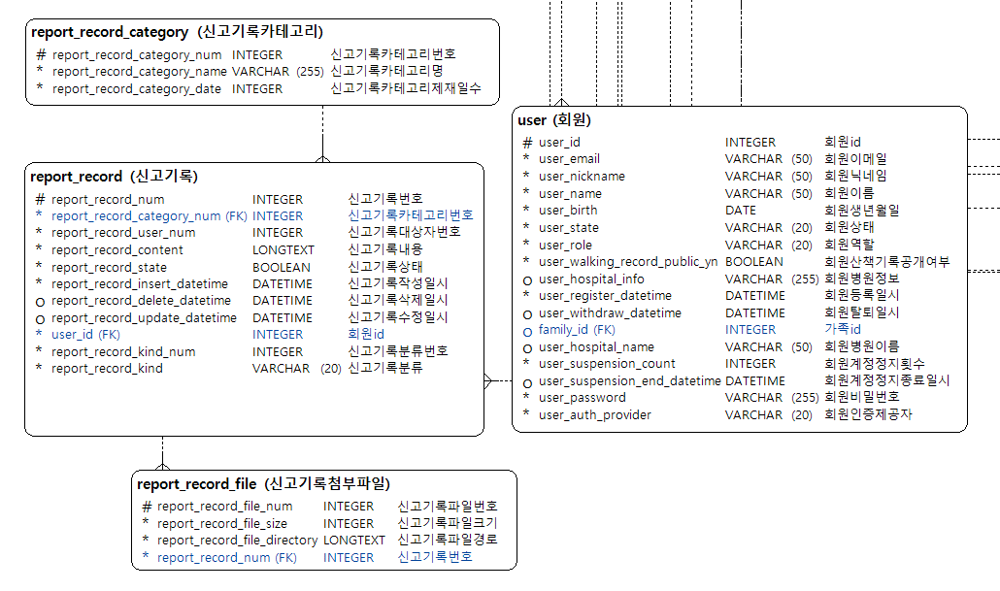
    
    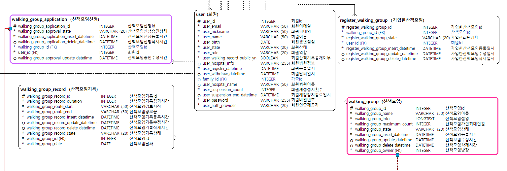

    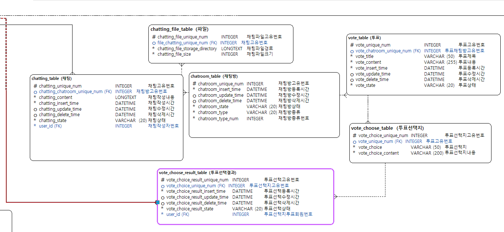   

    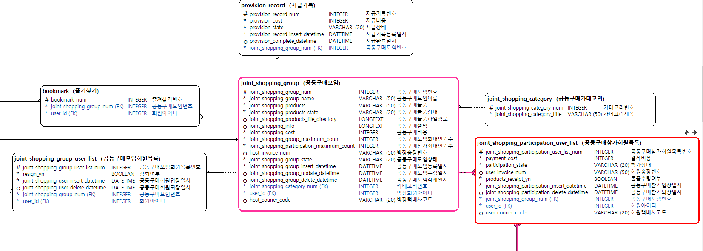   

    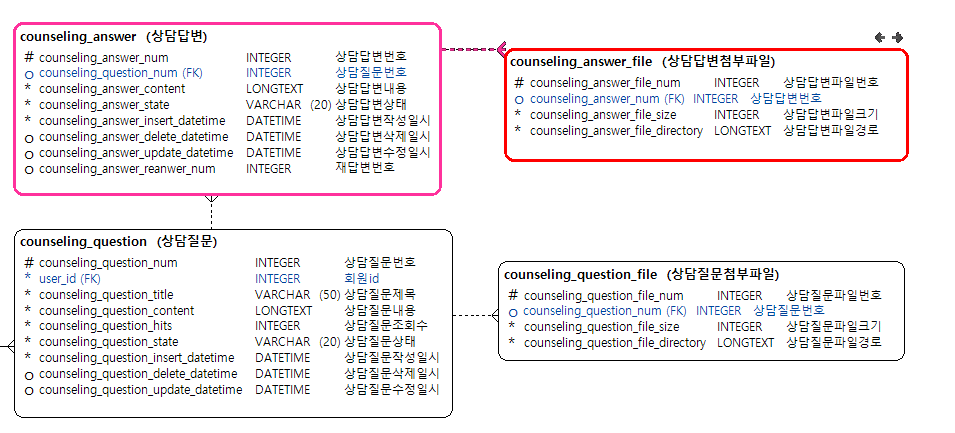   

    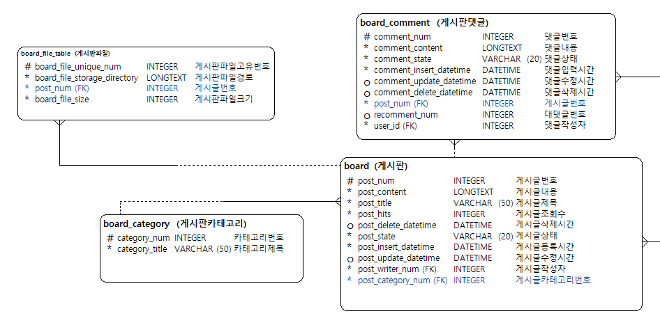   

    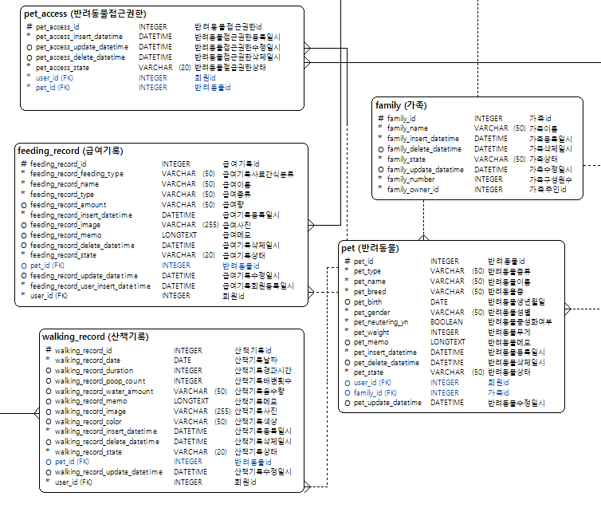   

### DDL
-
    [DDL 다운로드](./images/펫토리%20DDL%20v.07.txt)

## 기능 설계서(API)

  
기능 설계서

  

    

  

## 테스트 결과 보고서
### 채팅

 

   
채팅

   

- 채팅
    
    ## 채팅 방 생성 기능
    
    - 산책 모임 방, 공동 구매 모임 방이 생성되었을 때 해당 URL 이 호출되어 채팅 방이 자동으로 만들어진다.
    
    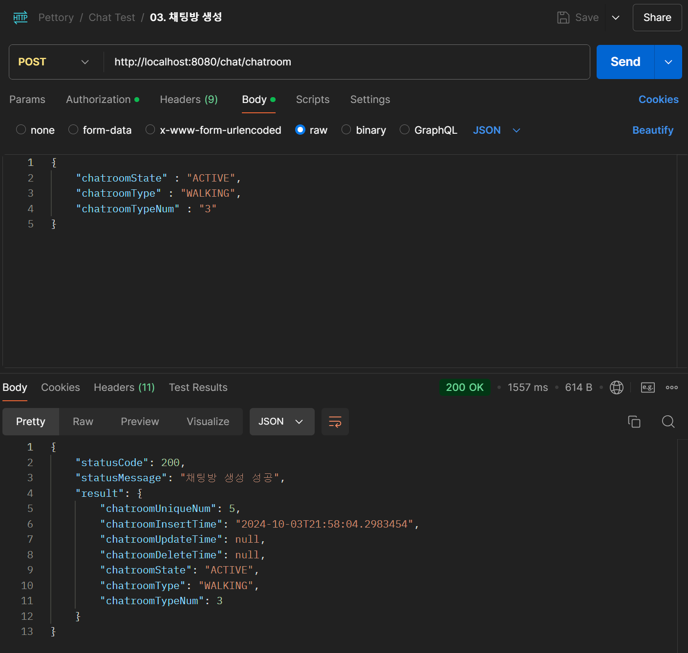
    
    ## 실시간 채팅 기능
    
    - 실시간으로 서버에 채팅을 전송 할 수 있다.
    
    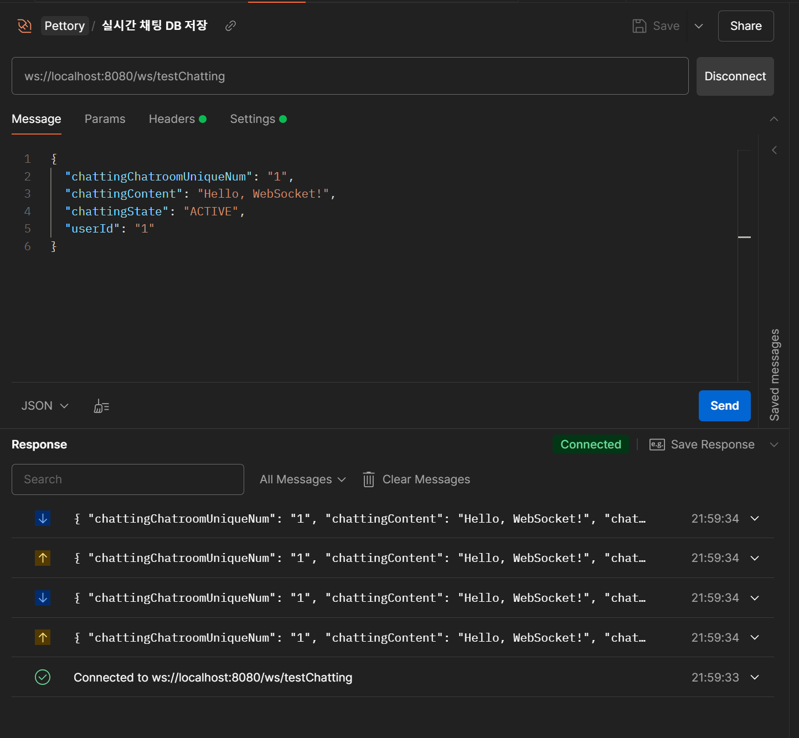
    
    - DB
    
    
    
    ## 채팅 수정 기능
    
    - 작성한 채팅을 수정할 수 있다.
    
    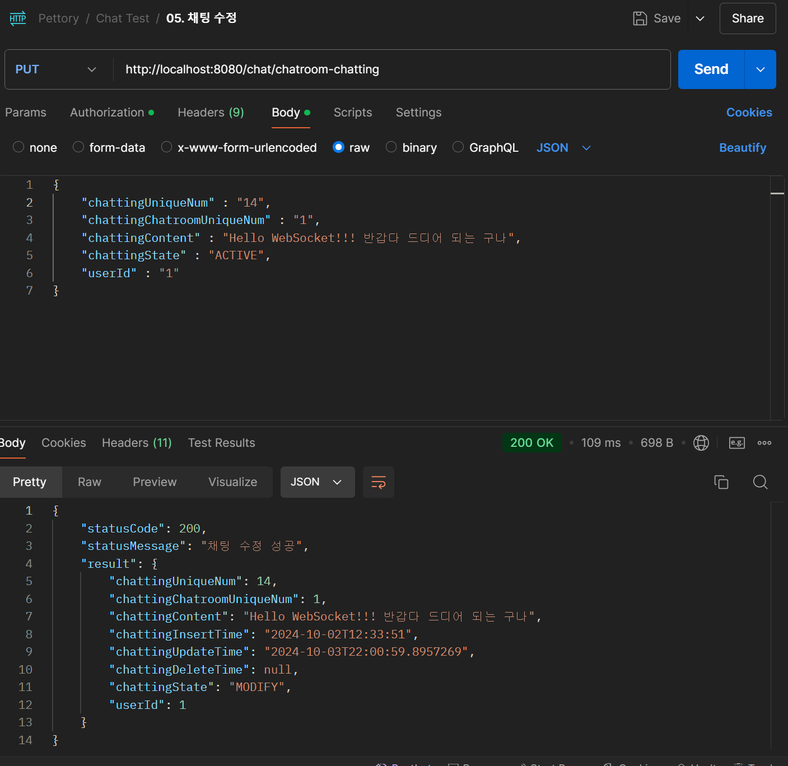
    
    ## 채팅 소프트 삭제
    
    - 채팅 상태를 DELETE 로 바꾸고 DB에서는 삭제를 안 하는 소프트 삭제를 실행 한다.
    
    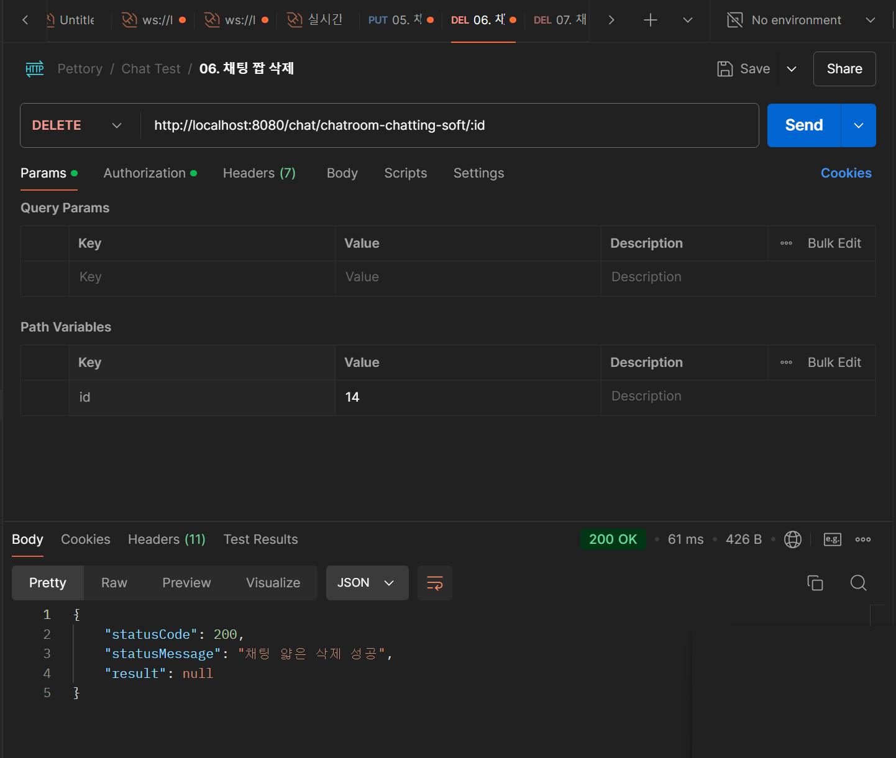
    
    ## 채팅 하드 삭제
    
    - 채팅을 DB에서 완전 삭제 한다.
    
    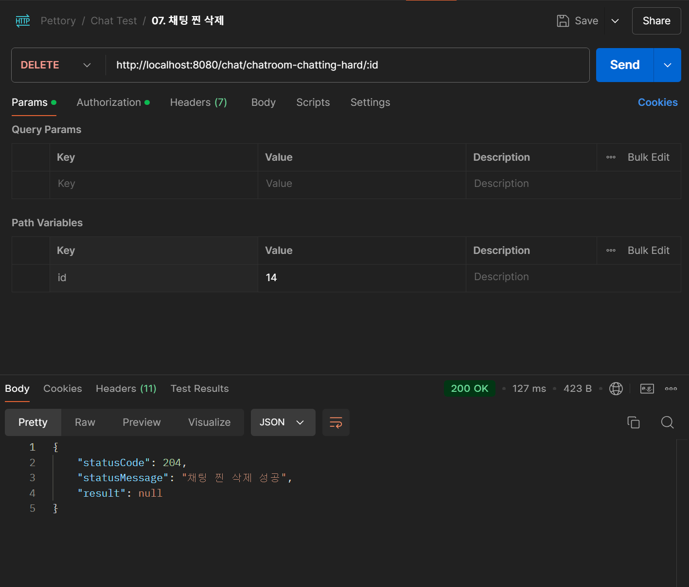
    
    ## 채팅 기록 조회
    
    - 채팅 방의 채팅 기록을 조회한다.
    
    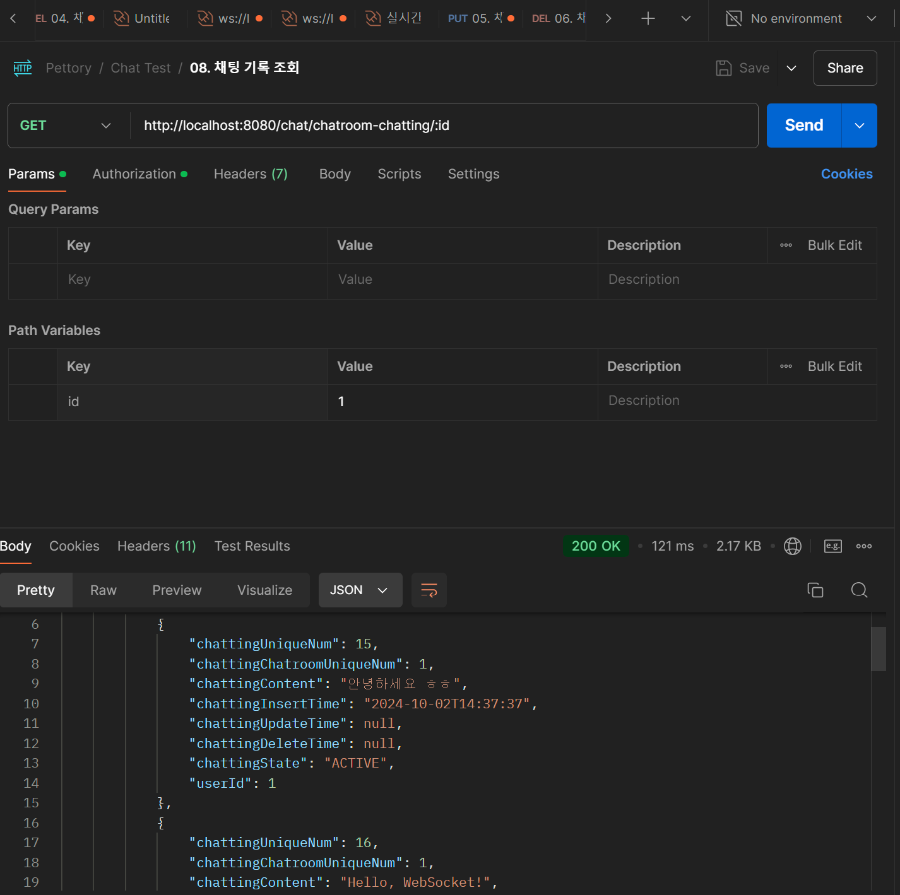
  

